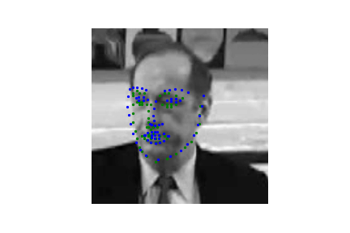
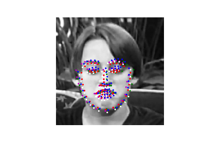
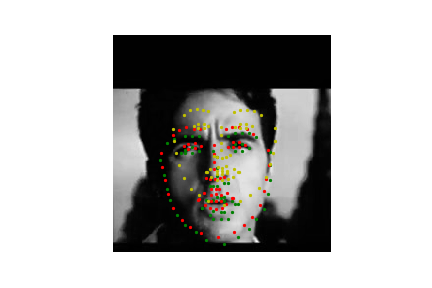

# education_report_for_youtube_faces_db

## About the report
This repo is basically single README file report, where I'm trying to summarize my experience of educating a CNN for mentioned DB. I've written that report during completing my Udacity course.

## About the dataset
[The facial keypoints dataset](https://www.cs.tau.ac.il/~wolf/ytfaces/) consists of 5770 color images. (3462 of these images are training images, 2308 are test images.) For each image there are 68 locations of facial keypoints (x, y).

## CNN architecture
Original dataset contains images with different dimensions. For the CNN it should be converted into one dimension. In the course materials the suggestion for the image dimensions was: 224x224. Plus it should be single channel gray image. I followed that recommendation when I've designed my CNN.

Again in the course as an example was suggested CNN from this [paper](https://arxiv.org/pdf/1710.00977.pdf).

After a lot of iterations I've come up with the following architecture:
| Layer  | Layer dim  | Output dim  | Parameters formula  | Parameters count  |
|--------|------------|-------------|---------------------|-------------------|
| Input image (greyscale)  |   | 224 * 224 * 1  |   |   |
|  Conv2d + ReLu |  1 * 32 * 3 |  222 * 222 * 32 | 1 * 32 * 3 * 3 + 32    |  320 |
| MaxPool2d | 2, 2 |111 * 111 * 32 | | | 
| Conv2d  + ReLu | 32 * 64 * 3 | 109 * 109* 64 | 32 * 64 * 3 * 3 + 64 | 18496 |
| MaxPool2d | 2, 2 | 54 * 54 * 64 | | | 
| Conv2d  + ReLu | 64 * 64 * 3 | 52 * 52 * 64 | 64 * 64 * 3 * 3 + 64 | 36928 |
| MaxPool2d | 2, 2 | 26 * 26 * 64 | | |
| Conv2d  + ReLu | 64 * 128 * 3 | 24 * 24 * 128 | 64 * 128 * 3 * 3 + 128 | 73856 |
| MaxPool2d | 2, 2 | 12 * 12 * 128 |
| Linear + ReLu | 1088 | 18432 * 1088 | 18432 * (1088 + 1) | 20072448 |
| Linear | 136 | 1088 * 136 | 1088 * (136 + 1) | 149056 |

It's simpler that an architecture from the paper.

Education parameters:
- lr = 0.001
- criterion = nn.MSELoss
- optimizer = optim.Adam
- batch_size = 10

## Results of the architecture.
That results is the best I've achieved. The amount of train epochs is 250.

## Comparison between different count of epochs
The idea is to compare how well did CNN learned during 15, 50, 85 and 250 epochs. All following graphs have following colors:
- 15_epochs - magenta
- 50_epochs - white
- 85_epochs - red
- 250_epochs - blue
- 'true' value - green

Learning parameters are the same:
- lr = 0.001
- criterion = nn.MSELoss
- optimizer = optim.Adam
- batch_size = 10

Let's first take a look at images where the results look similarly good:

From these 2 images we can see that our CNNs learned something. But let's now check other images where we can see the difference more clearly.

From these two images we can clearly see that magenta points are worse than other points. Which means that 15 epochs is not enough for CNN. Let's exlude it from our consideration

Let's take a closer look at 3 cases - 50, 85, 250

From what I can see even considering that none of the CNNs match perfectly, the blue one is closer to expected results.

Let's check another test batch. It seems like 250 epochs trained CNN is doing pretty well.

## Overfitting consideration
I've run 700 epochs of the training for my CNN. I've recorded loss functions values of test and train datasets. There are two plots I want to share. First one show loss functions for test and train datasets:

An because when I'm looking at this plot I don't see any overfitting, I've decided to plot the second one with a diff of loss functions for test and train (test_loss - train_loss):

At some point I'm expecting to see that test loss function would be significantly higher than train loss function. But I don't see it on the plot. I don't really know if that means that overfitting didn't happen during 700 epochs.

## Comparing learning rate 0.1 vs 0.001

Let's take a closer look at the same CNN architecture learned during 85 epochs. But the learning rate would be 0.1 instead of 0.001. Let's compare plots for loss functions (for both train and tests datasets). What we can see on the plot:

* For 0.1 learning rate plots are not smooth
* For 0.1 both plots are bigger than for 0.001

My intuition is that with 0.1 steps during the education are too big and it can't converge to the result.

Regarding the difference between test - train loss functions we can see the same peaks. In general average values are similar for both 0.1 and 0.001 learning rates.

Let's compare several train images. Red is 0.001, yellow - 0.1, green - expected values.

We can clearly see that the performance of CNN learned with 0.1 rate is much worse.

## SGD vs Adam
Again parameters are the same - 85 epochs, but now we compare SGD vs Adam algorithms.

Here we need to take a look at this plot with learning rates. We can clearly see that loss function values are higher for SGD than for Adam algorithm.

But let's also check test images. Adam is white, SGD - magenta. And again it seems like during the same amount of epochs Adam converged faster than SGD. The result is much better

## MSE Loss vs SmoothL1Loss
Again parameters are the same - 85 epochs, but now we compare different criteria MSE vs SmoothL1Loss.

Let's compare loss functions. It seems like smooth L1 gives smaller loss function value, but I don't think it make sense to compare absolute values, because probably the way how it's calculated now is different.

Let's compare test images. MSE - white, SmoothL1 - magenta

Considering these images I don't have a strong opinion which criterion is better. It seems like both are doing their job pretty well. Even if each of them does mistakes on different images.

## Adding dropout for two last convolution layers
The only difference - we have dropout with probability 0.3 for 2 last convolution layers and a dropout with same 0.3 probability for the penultimate linear layer.

Loss functions graphs, where model_006 means our original model (model_004) with dropouts:

Test image results:

Considering these results, I would say it's not worse than the original model without dropout layers. But it's hard to say that the model exceed drastically the original one. Probably with the higher count of epochs we'll see the difference.

## Having more linear layer

Let's add one more linear layer and check how it goes.

| Layer  | Layer dim  | Output dim  | Parameters formula  | Parameters count  |
|--------|------------|-------------|---------------------|-------------------|
| Input image (greyscale)  |   | 224 * 224 * 1  |   |   |
|  Conv2d + ReLu |  1 * 32 * 3 |  222 * 222 * 32 | 1 * 32 * 3 * 3 + 32    |  320 |
| MaxPool2d | 2, 2 |111 * 111 * 32 | | | 
| Conv2d  + ReLu | 32 * 64 * 3 | 109 * 109* 64 | 32 * 64 * 3 * 3 + 64 | 18496 |
| MaxPool2d | 2, 2 | 54 * 54 * 64 | | | 
| Conv2d  + ReLu | 64 * 64 * 3 | 52 * 52 * 64 | 64 * 64 * 3 * 3 + 64 | 36928 |
| MaxPool2d | 2, 2 | 26 * 26 * 64 | | |
| Conv2d  + ReLu | 64 * 128 * 3 | 24 * 24 * 128 | 64 * 128 * 3 * 3 + 128 | 73856 |
| MaxPool2d | 2, 2 | 12 * 12 * 128 |
| Linear + ReLu | 5440 | 18432 * 5440 | 18432 * (5440 + 1) | 100 288 512 |
| Linear + ReLu | 1088 | 5440 * 1088 | 5440 * (1088 + 1) | 5 924 160 |
| Linear | 136 | 1088 * 136 | 1088 * (136 + 1) | 149056 |

Loss functions:

The difference between test and train loss functions 

Test images:

The prediction is extremely inaccurate and the results are super strange. It seems like the prediction points are almost identical for different images. I can't explain that.

## My mistakes during the whole process.
1) using ReLu after the last Linear layerэпшк/ц
2) estimating Loss function for each batch, instead of accumulating it for all batches and estimating it for the whole epoch

